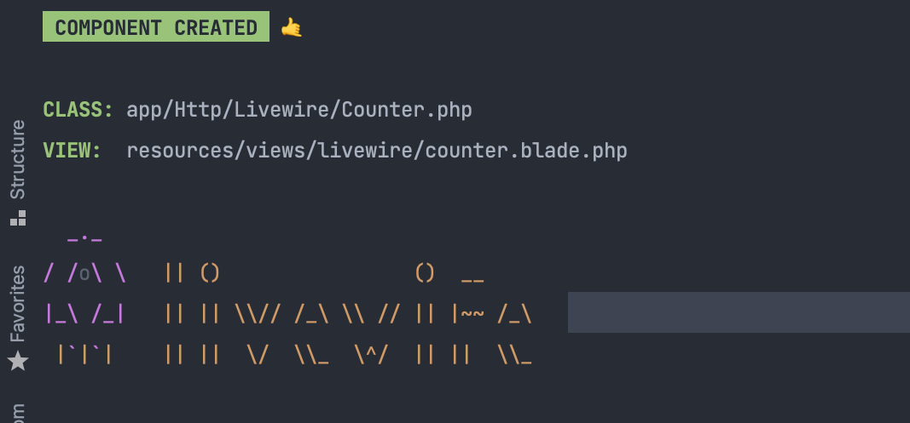

# Làm quen với Laravel livewire phần 1
## 1. Giới thiệu thiệu: 
 - Livewire là một full-stack framework Laravel giúp việc xây dựng các giao diện động trở nên đơn giản mà không để lại sự thoải mái của Laravel.
 - Cho phép tạo SPA mà không cần có javascript.
 - Kết hợp với laravel 7, tương tự như Vuejs, hoạt động phía backend và cú pháp dễ dàng sử dụng.

## 2. Nội dung tìm hiểu :
 1. Quickstart
 2. Cách hoạt động 
 3. Prop và action
 4. Events
 5. Lifecycle Hooks
 
## 3. Let's start :
 ### Quickstart: 
 - Đầu tiên chúng ta cài đặt nó thông qua composer:
```
composer require livewire/livewire
```
  - Livewỉe được xây dựng thông qua js, cho nên nó cũng được include style, css như các js, css khác, bản chất đây là 1 component của laravel 7 nên chúng ta có 2 cách dùng như sau :
```html
...    @livewireStyles // hoặc <live-wire:styles>s</live-wire:styles>
</head>
<body>
    ...

    @livewireScripts //  <live-wire:scripts></live-wire:scripts>
</body>
</html>
```

 - Đến với 1 ví dụ đơn giản, đầu tiên t tạo 1 component : ```php artisan make:livewire counter```
 - Chúng ta thấy rằn nó sẽ gen cho chúng ta 1 class và 1 view tương ứng :

 - Bán bạn để ý rằng : Component CREATED vì livewire chỉ support "Laravel 7.0 or higher" nên component này chỉ có trên laravel 7 trở lên
 ```html
<!--counter.blade.php-->
<div style="text-align:center">
    <button wire:click="increment">+</button>
    <h1>{{ $count }}</h1>
    <button wire:click="decrement">-</button>
</div>

```
```php
//    Counter.php
    public $count = 1;
    public function increment()
    {
        $this->count++;
    }
    public function decrement()
    {
        $this->count--;
    }
    public function render()
    {
        return view('livewire.counter', ['count' => $this->count]);
    }
```
Cùng xem kết quả nào ?  

 ### Cách hoạt động : 
 - Đâu tiên chúng t mở tab network và click vào button " + ", chúng t thấy rằng nó sẽ gửi 1 ajax với URI ```livewire/message/counter```. 
 - Và khi mở route:list thì chúng ta sẽ thấy có 1 route là :
```POST - livewire/message/{name}``` và đây chính xác là route mà ajax gửi lên khi chúgn ta click vào button có chưa event của livewire
 - Ngoài ra chúng ta cũng thấy rằng route này có action là ```Livewire/Connection/HttpConnectionHandler```
```php
public function __invoke()
{
    $this->applyPersistentMiddleware();

    return $this->handle(
        request([
            'fingerprint',
            'serverMemo',
            'updates',
        ])
    );
}
```
 - Chúng ta thấy được rằng có 1 hàm __invoke() ở đây, hàm này được gọi là magic method, điều này có nghĩa là nó sẵn sàng trigger nếu như chúng ta không định nghĩa gì.
 - Đầu tiên chúng t hãy xem : ```$this->applyPersistentMiddleware()``` : 
  1. Ban đầu nó gọi đến : ```$this->makeRequestFromUrlAndMethod``` và truyền 2 tham số, 1 lầ base url của ta, và 2 mà method
  2. Bên dưới t thấy được là, chúng sẽ tạo ra cho chúng ta 1 request mới, và set session hiện tại của laravel vào request đó, và resolve cho ta 1 request mới.
 - Tiếp theo là hàm handle : đói với livewire phiên bản trước chúng ta có thể thấy phần body gửi lên sẽ được truyền thẳng vào request và được xử lý theo từng cái thuộc tính 1. (xem các phiên bản cũ hơn bạn sẽ rõ nó hd rất đơn giản, chỉ là phân tách params và gọi method tương ứng). nhưng ở bản mới này, nó chỉ rút gọn lại mảng.
 - Điều quan trọng là nó vẫn 1 cách xử lý đó là : vẫn phân tách params gửi lên -> tạo resoler request -> app('livewire') được gọi và trả về instance của nó đã bảo gồm các requét, method, params đã qua xử lý. Nếu tìm hiểu sây thì chúng t sẽ thấy 2 cách hoạt động chính -> callMethod hoặc là fire event.

### Prop và action :
 #### Prop :
 - Prop ở đây đơn giản chỉ là 1 thuộc tín của class livewire đó, ở vd trên t có ```count``` là 1 prop và không được là ```rules``` ```messages```
 - Ngoài cách gắn giá trị trực tiếp vào prop, chúng ta cũng có thể init nso bằng hàm ```mount``` :
```php
public $message;

public function mount()
{
    $this->message = 'Hello World!';
}

// hoặc là dùng fill,livewire cũng tạo hàm fill cho chúng ta, khi chúng ta cần mount nhiều props.
public function mount()
{
    $this->fill(['message' => 'Hello World!']);
}
```
- Để reset nó về giá trị ban đầu, ta làm như sau:
```php
$this->reset('search');

 // hoặc 
$this->reset(['search', 'isActive']);
```
- Hoặc chúng ta cũng có thể binding blade vào. điều này có nghĩa là khi ta nhập, thì livewire sẽ auto update messsage cho ta, bạn có thấy nó giống Vuejs không :v
```html 
<input wire:model="message" type="text">
<h1> {{ $message }}</h1>
```
- Chú ý: Mặc định rằng, livewire sẽ tự động apply thay đổi trên input với tg là 150ms. điều này theo nguyên lý hoạt động của nó, khi bạn nhập đoạn text vậy thì nó sẽ luôn luôn call ajax lên server để update lại, (oh no). Do đó, livewire sẽ đề nghị bạn nên dùng debounce modifier cho việc delay change input.
```html
<input type="text" wire:model.debounce.500ms="name">
```
- Thường thì update property rất cần thiết cho các ô select, nhưng đối với các ô input, ta nên sử dụng lâzy
```html
<input type="text" wire:model.lazy="message">
```
- Trong 1 vài trường hợp, bạn không cần phai live input, Livewire có ```.defer```. cái này giúp chúng ta update data khi gửi request tiếp theo

```html
<input type="text" wire:model.defer="query">
<button wire:click="search">Search</button>
// query sẽ được update khi search đc click.
```
#### Action : 
 - Lục đích của action là có thể dễ dàng listen được tương tác trên page và gọi đúng method trên livewire Class.
 - Ở quickstart, ta đã có về ví dụ action này, 2 action là increment và decrement, khi được cick thì nó sẽ được gọi đến class livewire làm tăng/giảm $count.
 - Livewire cung cấp cho chúng ta những directive để lắng nghe event từ browser đơn giản hơn. 
   
``` wire:[dispatched browser event]="[action]".```

   | Event   |Directive|
   |----------|:-------------:|
   | click |  wire:click |
   | keydown |    wire:keydown   |
   | submit |    wire:submit   |
ngoài ra còn rất nhiều, các directive này dường như là tương tự với vue.
 
 - Truyền param vào actions : Giả sử ta có 1 action 
```php
public function addTodo($id, $name)
{
    ...
}
```
thì 
```html
<button wire:click="addTodo({{ $todo->id }}, '{{ $todo->name }}')">
    Add Todo
</button>
```
 - Event modifier : ngoài ra, livewire còn cung cấp cho chúng ta thêm các " modifiers " để thêm linh động cho các events

| Modifier   |Description|
|----------|:-------------:|
| stop |  tương tự với event.stopPropagation() |
| prevent |   tương tự với event.preventDefault()  |
| self |   Thường được dùng khi kích hoạt 1 event bởi chính nó, điều này giúp ngăn chặn các event được kích hoạt từ children   |
| debounce.150ms |  Thêm debounce  |
 Hoặc các Keydown Modifiers : 

| Native Browser Event	| Livewire Modifier
|----------|:-------------:|
| Backspace|	backspace|
| Escape|	escape|
| Shift|	shift|
| Tab	|tab|
| ArrowRight|	arrow-right|

Và Magic Actions :

|Function	| Description
|----------|:-------------:|
|$refresh	| Sẽ re-render component và không có action nào được thực thi.
|$set('property', value) | Shortcut để update value của 1 prop
|$toggle('property') | Shortcut để toggle 1 prop có type là boolean
|$emit('event', ...params)	| Cái này dùng Vue thì hay gặp, dùng để phát sự kiện  với param đc cung cấp
|$event| Ví dụ wire:change="setSomeProperty($event.target.value)", đọc như này chắc các bạn cũng hiểu nhỉ ```$event.target.value```
    
### Events : 
 - Livewire components có thể giao tiếp với nhau thông qua các event global system. Miễn là cả 2 Component đó  nằm trên cùng 1 page. Chúng sẽ giao tiếp với nhau bằng events và listeners
 - Có 3 cách để firing events :
   -  ```<button wire:click="$emit('postAdded')">``` // call trên blade (component)
   -  ``` $this->emit('postAdded');    ``` // call ở Livewire class 
   - ``` <script> Livewire.emit('postAdded') </script> ``` Call ở javascript
 - Làm việc với gì cũng vậy, khi có events thì sẽ có listeners dùng để lắng nghe sự kiện đó, livewire cung cấp cho ta đơn giản bộ đôi này rất dễ dàng
Ví dụ đơn giản ở đây là khi ta trigger evenet postAdded bằng 1 trong 3 cách trên thì incrementPostCount sẽ được exec:
```php
class ShowPosts extends Component
{
    public $postCount;

   // $listeners cho phép t register list event => listener theo key => value
   // nếu event trùng với tên action thì nó chỉ cần khai báo 1 làn đủ
    protected $listeners = ['postAdded' => 'postAdded'];
    // or protected $listeners = ['postAdded'];
    
    // hoặc 
    protected function getListeners()
    {
        return ['postAdded' => 'postAdded'];
        // or return ['postAdded'];
    }

    public function postAdded()
    {
        $this->postCount = Post::count();
    }
}
```
 - Ta cũng có thể pass data : ```$this->emit('postAdded', $post->id);```
```php
public function postAdded(Post $post)
{
    dd($post);
}
```

#### Scoping Events : 
 - Mặc định emit sẽ phát event global miễn là trên cùng 1 page, nhưng đôi khi chúng ta chỉ muốn emit lên component cha của nó
```$this->emitUp('postAdded');``` sẽ giúp chúng ta làm điều này
```$this->emitTo('counter', 'postAdded');``` sẽ giúp chúng ta phát event tới component với name là counter 
```$this->emitSelf('postAdded');``` hoặc là chỉ phát sự kiện đến component đó
 - Livewire cũng cho phép ta đăng ký event trong js như này : 
```js
<script>
    Livewire.on('postAdded', postId => {
        alert('A post was added with the id of: ' + postId);
    })
</script>
```

#### Dispatching Browser Events :
 - Livewire cho phép bạn fire events trên browser window như này :
  Livewire class
```php
$this->dispatchBrowserEvent('name-updated', ['newName' => $value]); //
```
 Trên javascript
```js 
<script>
window.addEventListener('name-updated', event => {
    alert('Name updated to: ' + event.detail.newName);
})
</script>
```
 Hoặc là component blade: 
```html
<div x-data="{ open: false }" @name-updated.window="open = false">
    <!-- Modal with a Livewire name update form -->
</div>
```
### Lifecycle Hooks: 
 - Nói không phải mê tín chớ nó tương tự như thằng vue rứa :)))

| Hooks| 	Description|
|----------|:-------------:|
| mount| Chỉ chạy 1 lần, sau khi components đc khởi tạo và trước khi render()|
| hydrate| Chạy mỗi khi có request, thực hiện trước khi exec 1 action hoặc render() |
| updating| Chaỵ trước khi prop được update|
| updated| Chạy sau khi prop được update|
Ngoài ra còn có thể add thêm biến phía sau updating, updated vd 
hydrateFoo, updatingFoo, updatedFoo => các hooks này chạy và tương tác với biến $foo, nếu biến có 2 từ thì nhận cả 2 vd : $foo_bar hoặc $fooBar.

#### Javascript hooks : Livewire cung cấp cho bạn cơ hội thực thi javascript trong các sự kiện nhất định.
 - Cái này thì chắc dễ hiểu, đọc cái là hiểu ngay rồi.
```js
<script>
    document.addEventListener("DOMContentLoaded", () => {
        Livewire.hook('component.initialized', (component) => {})
        Livewire.hook('element.initialized', (el, component) => {})
        Livewire.hook('element.updating', (fromEl, toEl, component) => {})
        Livewire.hook('element.updated', (el, component) => {})
        Livewire.hook('element.removed', (el, component) => {})
        Livewire.hook('message.sent', (message, component) => {})
        Livewire.hook('message.failed', (message, component) => {})
        Livewire.hook('message.received', (message, component) => {})
        Livewire.hook('message.processed', (message, component) => {})
    });
</script>
```

Kết thúc phần 1 tại đây. ở phần sau sẽ tìm hiểu về validation, form, upload ...


Src: https://laravel-livewire.com/docs/2.x/
